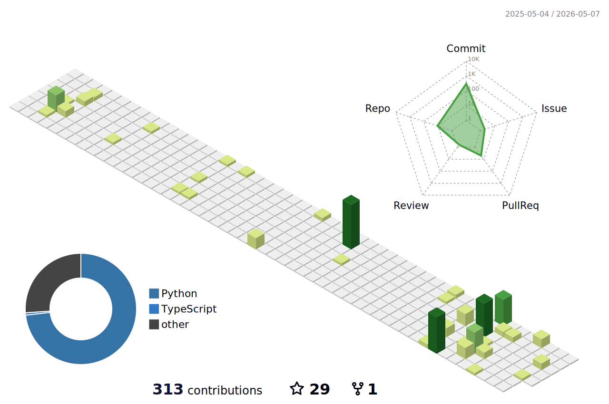

### Hi there 👋
### I'm Suizhi Huang.

# About Me
- 🍒  Graduate student in progress.
- 📍  Shanghai.
- 👨‍🎓  SJTU.
- 👩‍💻  CV(Multi-task, Multi-modal, Federated Learning, SlAM,).
- 📧  Personal: [sunrien.huang@gmail.com](mailto:sunrisen.huang@gmail.com).
- 📧  Official: [huangsuizhi@sjtu.edu.cn](mailto:huangsuizhi@sjtu.edu.cn).

# About My Github

<!--

-->

  

   

