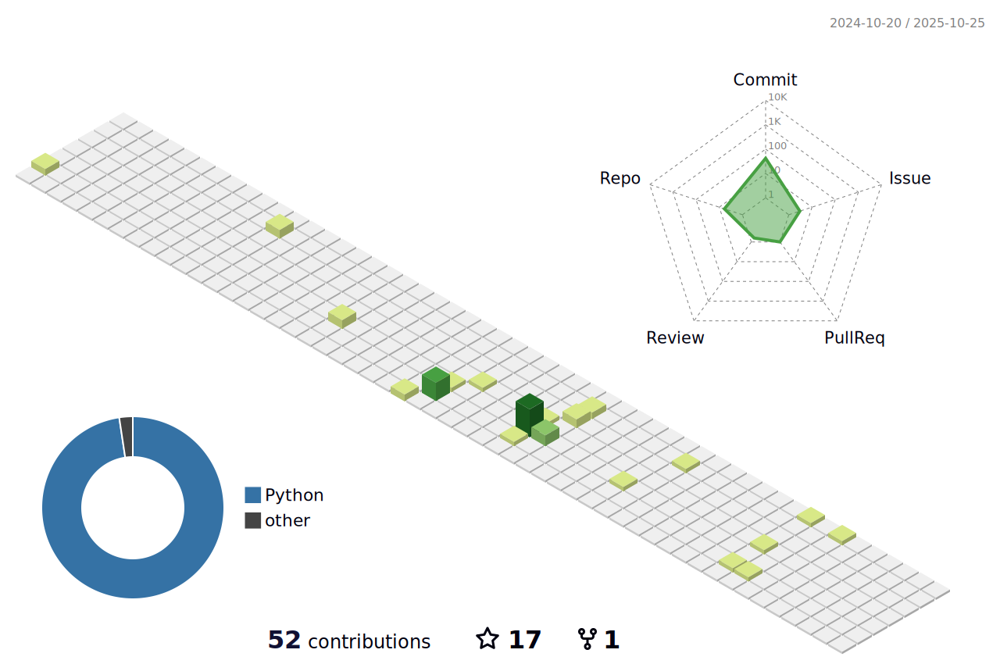

### Hi there 👋
### I'm Suizhi Huang.

# About Me
- 📍  Singapore.
- 👨‍🎓  NTU.
- 👩‍💻  Federated Learning, CV(Multi-task Learning, Generative Model), Continual Learning
- 📧  Personal: [sunrien.huang@gmail.com](mailto:sunrisen.huang@gmail.com).
- 📧  Official: [suizhi001@e.ntu.edu.sg](mailto:suizhi001@e.ntu.edu.sg).

# About My Github

<!--

-->

  

   

